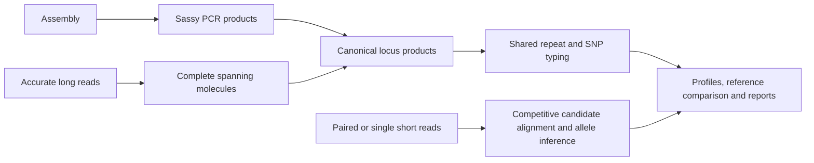

# mlvamaps

`mlvamaps` calls microbial MLVA/VNTR loci from Illumina reads, accurate long or
amplicon reads, and genome assemblies. It uses a user-supplied primer panel, so
no organism or typing scheme is hard-coded.

The main outputs are an MLVA fingerprint, per-locus calls and evidence, and a
self-contained HTML report. Reference databases add alignment-based reference support using nucleotide
variation and VNTR repeat-length evidence.

mlvamaps uses input-specific evidence to produce compatible locus calls:



Assembly product selection remains MLVA_finder compatible. Long reads are
measured directly. Short reads use competitive minimap2 alignment against
candidate MLVA allele contexts, followed by shared allele inference.
See the [competitive workflow](docs/workflows/competitive-fastq.md).

The defaults are `--sr-engine competitive` and `--lr-engine spanning`.
Use `--sr-engine repeat-likelihood` to opt into the independently implemented
E/S/F/FRR model inspired by [GangSTR concepts](https://doi.org/10.1093/nar/gkz501).
In that model, paired length inference needs a measured library distribution; when the available
flanks cannot estimate it, provide `--insert-mean BP --insert-sd BP`. Flanking-only
or unanchored repeat evidence cannot produce an exact count.

See [the model, formulas, diagnostics and validation limits](docs/concepts/locus-reconstruction.md).
Missing and unresolved calls remain explicit and are never converted to zero.

Reference typing uses one Emu-inspired alignment-likelihood framework:
Sassy-recovered assembly amplicons are aligned to observed reference loci with
Parasail; FASTQ molecules are competitively aligned to observed reference
amplicons with minimap2. Nucleotide mismatches and repeat-length disagreement
both contribute. Assemblies use isolate support; mixed read samples use EM.
This is an independent implementation; the Emu package is not required.

Sassy-backed assembly PCR, MLVA_finder-compatible repeat counts and tables,
recovered amplicons, and read SNP evidence remain available. Assembly runs with
a database also retain reference-relative mismatch counts, repeat differences,
and alignment CIGARs in `classification/assembly_reference_evidence.tsv`.

Optional repeat-profile trees visualize sample similarity and do not determine
reference classification. See [alignment-based classification](docs/concepts/mapping-classification.md)
and [migration to the emu workflow](docs/workflows/emu-migration.md).

## Install

### Conda/Miniforge (recommended)

[Miniforge](https://github.com/conda-forge/miniforge) provides `conda` on Linux
and macOS. Until the Bioconda package is published, install from this checkout:

```bash
git clone https://github.com/microbemarsh/mlvamaps.git
cd mlvamaps
conda env create -f environment.yml
conda activate mlvamaps
python -m pip install --no-deps .
```

For large compressed FASTQs, enable the optional native I/O accelerators:

```bash
conda install -c conda-forge rapidgzip python-isal
# Alternatively, inside the existing environment:
python -m pip install '.[fastq]'
```

Rapidgzip supplies parallel input decompression; ISA-L accelerates gzip output.
Both expose Python APIs. The caller automatically budgets decompression within
`--threads` and retains HTSlib parsing. See the
[Illumina performance notes](docs/workflows/illumina.md#performance-and-cpu-allocation)
for platform support, timings, and the I/O benchmark.

Verify the installation:

```bash
mlvamaps --version
mlvamaps --help
```

After the Bioconda recipe is accepted, installation will be:

```bash
conda create -n mlvamaps -c conda-forge -c bioconda mlvamaps
conda activate mlvamaps
```

> **Bioconda status:** the `mlvamaps` recipe is staged in
> [`packaging/bioconda/meta.yaml`](packaging/bioconda/meta.yaml). Its native
> dependencies include the `sassy>=0.2.2` command-line tool used for primer
> matching. If Sassy is installed outside the active environment, set
> `SASSY_BIN` to its executable path.

## Run your first sample

You need:

1. a FASTA/FASTQ input; and
2. a CSV or TSV primer panel with at least `locus_id`, `forward_primer`, and
   `reverse_primer` columns.

A richer panel can also describe repeat motifs, flanks, expected repeat ranges,
and accepted amplicon sizes. See the [input format reference](docs/reference/input-formats.md).

### Genome assembly

```bash
mlvamaps call \
  -p examples/mlva_loci.example.tsv \
  -i sample.fasta \
  -o results/sample \
  -t 8
```

### Paired-end Illumina reads

```bash
mlvamaps call \
  -p panel.tsv \
  -i sr \
  --fq1 sample_R1.fastq.gz \
  --fq2 sample_R2.fastq.gz \
  --sample-id sample \
  -o results/sample \
  -t 8
```

For a directory containing exact `SAMPLE_1.fastq.gz` / `SAMPLE_2.fastq.gz`
pairs:

```bash
mlvamaps call -p panel.tsv -i reads/ --short-reads -o results -t 8
```

### Accurate long or amplicon reads

```bash
mlvamaps call -p panel.tsv -i sample.fastq.gz -o results/sample -t 8
```

## Find the results

Start with:

| Output | Purpose |
| --- | --- |
| `report.html` | Human-readable calls, QC, evidence, and matches. |
| `mlva_fingerprint.tsv` | Sample-by-locus repeat-copy-number profile. |
| `calls.tsv` | Tidy per-locus calls and statuses. |
| `locus_repeat_counts.tsv` | Compact individual-locus repeat counts. |

Failed or unresolved loci are reported explicitly rather than silently changed
to zero. See the complete [output reference](docs/reference/outputs.md) for all
evidence and diagnostic files.

Single-input calls write directly to the requested output directory. Directory
and manifest calls write each sample under `OUTDIR/<sample_id>/` and place only
batch-wide aggregate tables and status information under
`OUTDIR/batch_summary/`.

## Build a reference database

Build directly from NCBI assemblies for one taxon:

```bash
mlvamaps build-reference \
  --taxid 86661 \
  -p panel.tsv \
  -o references \
  -t 16
```

The panel may be a minimal `primer.csv` (locus, forward primer, reverse primer)
or a rich CSV/TSV panel. To compare one panel across taxa, provide `taxids.csv`:

```csv
taxid,name
86661,bacillus_cereus_group
1280,staphylococcus_aureus
```

```bash
mlvamaps build-reference \
  --taxids-csv taxids.csv \
  -p panel.tsv \
  -o references \
  -t 16
```

Multi-taxon builds write:

- `taxon_reference_summary.tsv`: one row per taxon;
- `taxon_locus_amplifiability.tsv`: one row per taxon and locus, suitable for
  compatibility heatmaps;
- one isolated extraction/QC work area per taxon; and
- a combined top-level database containing all taxa for automatic taxon
  identification.

Candidate indexes and the Deacon index are built once from the
merged cohort, including when `taxids.csv` contains only one taxon.

A locus is amplifiable when at least one examined genome produces an amplicon
retained by the normal primer-matching and filtering rules. Any retained reference amplicon remains available for comparison, including
loci represented by a single genome. Taxa with no usable loci are recorded
and do not stop later taxa.

Use a built database during calling:

```bash
mlvamaps call \
  -i sample.fasta \
  --database references \
  -o results/sample
```

Current databases store reusable `competitive_mapping/candidate_contexts.fasta`,
`candidate_metadata.tsv`, short/long minimap2 indexes, and a broad real-genome
Deacon recruitment index. A rich panel may still be used without a
database; bounded contexts are then synthesized from its primers, flanks,
repeat motif, expected range, and observed database states when available.

For a multi-taxid build, that command automatically loads the saved panel and
taxon metadata, then identifies the closest reference IDs with taxon annotations. No separate panel,
target taxid, calibration artifact, or taxon-identification flag is required.
Databases that predate schema 2.0 must be rebuilt with the current
`mlvamaps build-reference` so all competitive-mapping and recruitment assets
have reproducible provenance.

See the [reference-building guide](docs/workflows/reference-building.md) for
local assemblies, metadata, resuming downloads, and output interpretation.
See the [workflow architecture](docs/workflows/architecture.md) for resource
reuse, streamed candidate mapping, and batch thread allocation.

## Common next steps

- Run `mlvamaps COMMAND --help` for command-specific options.
- [CLI options and thresholds](docs/reference/cli.md)
- [Input and panel formats](docs/reference/input-formats.md)
- [Output file reference](docs/reference/outputs.md)
- [Calling and profiles](docs/concepts/calling-and-profiles.md)
- [Dataset aggregation and MYOGA export](docs/workflows/myoga-export.md)

`mlvamaps` uses 32 threads by default. Pass `-t N` to set a limit or `-t 0` to
use all detected CPUs. Use `--quiet` to suppress progress messages.

## Development

```bash
conda env create -f environment.yml
conda activate mlvamaps
python -m pip install --no-deps -e .
pytest -q
```

The software is licensed under GPL-3.0-only. Please report problems through
[GitHub Issues](https://github.com/microbemarsh/mlvamaps/issues).
