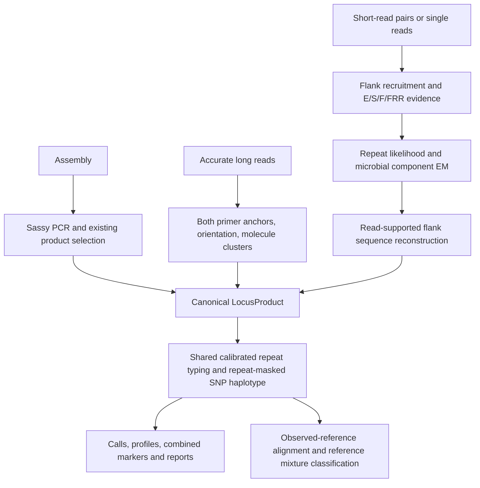

# Input-specific reconstruction and shared genotyping

This document describes the default long-read engine (`--lr-engine spanning`)
and the optional short-read engine (`--sr-engine repeat-likelihood`). Short reads
default to [competitive alignment](../workflows/competitive-fastq.md).

The reconstruction engines use a shared locus-level genotyping framework.
Assemblies use Sassy primer-directed in-silico PCR, accurate
long reads use complete spanning molecules, and paired short reads combine
enclosing, spanning-pair, flanking, and anchored repeat-rich evidence. Recovered
products use the same calibrated repeat measurement, repeat masking and sequence
haplotype representation. Reference comparison follows observed allele inference.

The short-read model is independently implemented from concepts described in
[Mousavi et al. (2019), GangSTR](https://doi.org/10.1093/nar/gkz501). No GangSTR code
or runtime dependency is used. This is a microbial/haploid model with optional
multiple microbial components, not a human diploid genotype model. cgMLST is not
an inference input or training target.

## Architecture and implementation

Previously, `unified_fastq.run_unified_fastq_inference` competitively mapped both
read technologies to generated/database candidate alleles and
`allele_inference.infer_alleles` chose repeat states. Assembly selected Sassy
products with historical MLVA_finder rules. The reconstruction engines separate recovery:



`locus_products.LocusProduct` records sample/locus/variant identity, canonical
sequence, source, molecule support, effective depth, estimated fraction,
reconstruction confidence, upstream repeat probabilities and evidence metadata.
`genotype_product` independently measures the recovered sequence using the
existing `assembly_equivalent_product_allele` calibration, then uses
`decompose_marker_sequence` for repeat masking. The SNP haplotype is a stable
SHA-256 prefix of the repeat-masked sequence; the combined marker contains the
measured repeat count and this haplotype. It is a sequence identifier, not a
reference-relative SNP coordinate list. Existing reference alignment still
provides relative sequence comparison.

Assembly product selection, mismatch rounds, calibrated primer sizes, rounding,
legacy files and rejection rules are unchanged. Selected assembly products now
also appear in the canonical files. In particular, the historical assembly
caller still rejects raw alleles of 100 or more; this legacy selection rule is
not a new FASTQ range restriction.

`locus_reconstruction.recover_long_reads` searches both orientations with existing
Sassy-backed `find_anchor`. A complete product requires both primer anchors in
order. Observed molecule sequences form exact clusters; the existing sequence
error/EM mixture implementation estimates cluster fractions. Counts are measured
from products, never assigned from reference alleles. Original strand, anchor
coordinates/edits, complete/recruited counts and cluster memberships are retained.
Partial molecules establish presence only. SPOARS correction remains available
in the legacy competitive LR workflow. The default is intended for accurate
reads; it does not claim noisy-ONT consensus performance.

## Short-read evidence and formulas

`repeat_likelihood` implements locus recruitment and likelihoods; it does not use
competitive known-allele mapping. Rich panels supply primers, repeat-adjacent
flanks, motif and unit length. Incomplete panels can borrow an existing database
context. Rich panel templates take precedence over database states. Four-base
flank seeds shortlist loci, then Parasail local alignment checks non-repeat
anchors in both orientations. Anchors require at least 10 aligned bases (or the
whole shorter flank) and at least 85% identity. When several loci match, the
assignment score sums the strongest flank alignment per mate, avoiding double
counting overlapping flank hits. The best locus must exceed the runner-up by
both 12 score points and 20% of its own score; otherwise the pair is excluded
and audited as ambiguous. These are conservative assignment guards, not
calibrated probabilities. An incidental short match therefore cannot veto much
stronger locus support. Entirely repetitive reads cannot identify a locus alone.
Score-only alignment bounds prioritize candidates and skip exact anchor checks
only when the remaining candidates cannot change the assignment. Compact audits
can also stop when the two strongest ambiguous matches are settled; full audits
retain all matching loci for ambiguous pairs. Full E/S/F/FRR evidence is computed
only for retained loci or full ambiguity audit rows.

Each physical pair has one likelihood vector; both mates may contribute sequence
alignment, but repeat and fragment geometry are counted once. Evidence tags can
overlap and are not independent molecule counts:

- **E:** both repeat boundaries are observed on a read. The boundary separation
  divided by repeat-unit length is the measured count `r_i`.
- **S:** inward-facing mates anchor opposite sides. Candidate fragment length is
  `d_i(R) = a_i + u R`, where `a_i` is the non-repeat mate geometry and `u` is unit
  length. Swapped mate order is supported. Discordant orientations do not supply S.
- **F:** a unique flank extends into motif-periodic sequence; its length supplies
  a lower bound `k_i`.
- **FRR:** a motif-periodic read with a flank-anchored mate supplies a lower bound.
  Unanchored FRRs are excluded. No human-genome off-target assumption is used.

E and F require the flank alignment to reach within three bases of the relevant
repeat boundary. An internal flank match can recruit a molecule and locate a
mate for S geometry, but cannot establish an observed boundary by extrapolating
across the missing flank. The three-base allowance tolerates terminal alignment
clipping; it is a heuristic, not an empirically calibrated error probability.
A single enclosing molecule can still yield an allele marked `LOW_DEPTH` when
its model confidence passes the threshold; independent insert calibration is
not required for enclosing evidence.

For each molecule and candidate, the implementation computes the composite score
(up to constants independent of `R`):

```text
ell_i(R) = E_i(R) + S_i(R) + B_i(R) + A_i(R)
E_i(R) = -0.5 ((R - r_i) / 0.20)^2                  if enclosing
S_i(R) = -0.5 ((a_i + u R - mu) / sigma_insert)^2  if S and not E
B_i(R) = -0.5 (max(k_i - R, 0) / 0.25)^2           if F/anchored FRR bound
A_i(R) = sum_m [SW(read_m, candidate_R) - max_Q SW(read_m, candidate_Q)] / 8
                                                       for E/F non-FRR mates
log L_haploid(R) = sum_i ell_i(R)
P_haploid(R) = exp(log L(R) - max log L) / sum_Q exp(log L(Q) - max log L)
```

SW uses Parasail match 2, mismatch -4, gap-open 5, gap-extension 1. Repeated read
alignments and candidate sequences are cached within a locus fit. This is a
composite likelihood: the length and alignment terms share evidence. Reported
probabilities are model confidence, **not empirically calibrated error rates**.

Insert estimation uses uniquely placed same-flank pairs, independently of unknown
VNTR lengths. It needs at least ten retained observations. Values more than
`max(5 bp, 4.5 * 1.4826 * MAD)` from the median are excluded; retained mean and SD
are used, with an SD floor of 1 bp. Both `--insert-mean` and `--insert-sd` override
estimation. Short amplicon contexts frequently cannot estimate inserts; provide
these values from independent library measurements when relying on S evidence.
Without a distribution, S supplies presence but no exact length likelihood.

Candidates start at zero, include the expected range plus a margin and observed
length/bound evidence, and expand by doubling while the upper-edge posterior mass
is at least 1%. Half-unit states are included for unit lengths of at least two
bases, with synthetic tract sizes rounded to integer bases. Expected ranges are
not hard limits. `--short-max-candidate-repeat-count` is the safety ceiling
(default 100); a one-million-base candidate-sequence guard also applies. Calls
whose posterior reaches the ceiling remain unresolved. Increase the explicit
ceiling to test expansions beyond it. Missing evidence is never zero repeats.

The 95% interval in the evidence table is the haploid plausible interval. In a
mixture it does not describe every component; inspect the component fractions and
reconstructed variant table instead.

## Mixtures and sequence recovery

Each molecule has a likelihood under multiple candidate components. Direct E
states and peaks of the molecule likelihood density initialize components,
including candidate states absent from the database. The existing numerically
stable `mapping_classification.fit_reference_mixture` EM routine fits

```text
z_ik = f_k exp(ell_i(R_k)) / sum_j f_j exp(ell_i(R_j))
f_k  = sum_i z_ik / number_of_molecules
```

The haploid winner and posterior remain in the diagnostics. The reported dominant
component comes from EM, not an average of component repeat counts. Dominant
confidence is measured on its assigned molecules. Both isolate and metagenome
modes retain components; convincing secondary components flag `MULTIPLE_VARIANTS`
even in an isolate. Trace products remain auditable. Meaningful secondary support
uses `--min-secondary-reads` and the larger of `--min-mixture-fraction` and
`1/(depth+1)`.

For each supported count, reads are realigned to the inferred synthetic product.
Exact complete observed products retain linked SNP/indel haplotypes, including
trace sequences; the existing sequence-error mixture EM fits their fractions. Partial
reads vote on non-repeat bases and indels once per molecule; overlapping mates
cannot double their depth. Bases below Q20 do not vote. Consensus requires a
70% vote; uncovered or conflicting positions become `N`, never an imputed
reference base. Same-repeat SNP haplotypes can separate when individual molecules
cover all detected variable sites. Otherwise ambiguous phase stays unresolved.
A synthetic repeat tract does not reconstruct repeat-internal SNPs. Canonical
product typing remeasures the final sequence, independently of the upstream
repeat posterior. Panel calibration and non-repeat indels can therefore produce
a measured allele different from the upstream tract count; both remain recorded.

The new engines use the existing sample thread allocation and a bounded locus
executor for SR fitting. Recruitment streams input and retains associated
molecules; full per-molecule candidate likelihood diagnostics scale with recruited
depth times the candidate grid. No new dependencies are required.

## CLI and outputs

Select reconstruction with these options:

```text
--sr-engine repeat-likelihood  # opt-in; competitive is the short-read default
--lr-engine spanning           # competitive retains the legacy/debug workflow
--insert-mean BP --insert-sd BP # both required together, positive finite values
```

Existing SR QC, minimum-depth, confidence, minimum-spanning-pairs, candidate-limit,
mixture and thread options apply. `--short-min-mapq` and
`--no-short-secondary-alignments` affect only competitive minimap2 inference.
LR raw-read mapping and SNP-pileup thresholds apply to the legacy competitive
workflow; canonical variant diagnostics record all retained components.

Additional files:

| File | Contents |
| --- | --- |
| `reconstructed_loci.fasta` | Canonically oriented products, one record per variant |
| `reconstructed_locus_variants.tsv` | Sequence, repeat, masked SNP haplotype, combined marker, depth, fraction, confidence and JSON evidence |
| `short_read_repeat_evidence.tsv` | E/S/F/FRR counts, best/second states, haploid interval, ceiling flag and components |
| `repeat_likelihoods.tsv` | Candidate counts, haploid log likelihoods and normalized posteriors |
| `molecule_repeat_likelihoods.tsv` | Per-molecule candidate scores |
| `molecule_candidate_evidence.tsv` | New-engine molecule anchors/classes/geometry or LR measurement/cluster audit; legacy engine retains its previous schema |
| `reconstruction_metadata.json` | Technology and estimated/overridden insert distribution |
| `classification/reference_repeat_comparison.tsv` | Observed count, closest known count, difference and KNOWN/NOVEL/NO_REFERENCE status |

`calls.tsv`, fingerprints, `allele_calls.tsv`, read predictions, variant tables,
mixture abundance, profile comparison and reports remain available. Unknown
alignment metrics are blank, not invented minimap2 values. `locus_snps.tsv` and `locus_mapping_summary.tsv` now describe canonical variant
alignments for the new engines. Their appended `method` and `coordinate_system`
columns distinguish this evidence: SNP coordinates are 1-based in the dominant
repeat-masked product, and depths are effective component molecule counts.
`canonical_locus_alignments.tsv` retains the alignment strings, CIGARs and scores;
`locus_mapping_references.fasta.gz` retains the masked reference sequences.
These are diagnostic variant differences, including trace evidence, rather than
thresholded raw-read pileups. The legacy engine retains raw-read mapping semantics. Combined-marker export
prefers canonical variants and reports ambiguous retained SNP haplotypes rather
than silently selecting one mixed sequence.

Reference classification still uses existing observed-reference alignment
likelihoods and reference EM, after repeat inference. It cannot overwrite inferred
sample counts. Read reference classification currently realigns original retained
reads; canonical variants supply marker export, while the original reads retain
molecule-level reference evidence. Known reference counts never define the new
engine's allowed states.

## Validation and remaining limits

Tests cover E/S/F/FRR and discordant evidence, robust insert estimation, direct and
paired inference beyond a read, out-of-range/novel/half-unit states, conservative
search ceilings, reverse strands, single-end reads, SNP phasing, 90:10/70:30/50:50
mixtures, database independence, and end-to-end assembly/LR/SR equivalence.
Assembly regression tests are retained. Validation for this change: **282 passed,
3 skipped** in the complete pytest suite; compilation, CLI help, benchmark CLI
smoke test and `git diff --check` also passed. The original 329-isolate data have
not been rerun.

Remaining limits include empirical calibration of the composite score, selection
bias in enclosing/spanning molecules, repeat interruptions, PCR stutter,
unidentifiable expansions beyond fragment lengths, unphased distant SNPs, and
noisy long-read correction. FRR abundance is not modeled as a Poisson depth term:
it supplies conservative anchored lower bounds only. Incomplete panels currently
borrow one database background per locus; highly divergent backgrounds may need
a richer panel. Identical flanks across loci are deliberately excluded rather
than assigned from shared motifs. Highly diverse LR error clusters can make the
existing pairwise sequence EM expensive. Synthetic tests demonstrate behavior,
not performance or accuracy on clinical/metagenomic cohorts.

## Review sequence

1. Canonical product object, shared genotype function, assembly adapter and regression checks.
2. LR spanning recovery, cluster evidence and legacy switch.
3. SR flank recruitment, evidence classes, insert estimation and candidate likelihoods.
4. Existing EM integration, sequence/phase reconstruction and cross-mode tests.
5. CLI/output integration, downstream novelty audit and canonical marker export.
6. Benchmark utility, documentation and expanded validation tests.

## Changed modules and review map

| Module or file | Purpose |
| --- | --- |
| `mlvamaps/locus_products.py` | Canonical product, shared repeat/SNP genotype, masked alignment and output writers |
| `mlvamaps/locus_reconstruction.py` | LR recovery, SR orchestration/sequence phasing, compatible evidence outputs |
| `mlvamaps/repeat_likelihood.py` | Flank recruitment, E/S/F/FRR classes, insert distribution, candidate scoring and component EM |
| `mlvamaps/assembly_call.py` | Route selected assembly products through the shared genotype interface |
| `mlvamaps/pipeline.py` | Default spanning LR dispatch; retain competitive LR pipeline |
| `mlvamaps/short_reads.py`, `short_read_mapping.py` | Selectable recovery, existing QC/report/profile writer reuse, insert metadata |
| `mlvamaps/unified_fastq.py` | Preserve legacy engine and adapt compatibility call projection |
| `mlvamaps/cli.py` | Engine switches and insert overrides |
| `mlvamaps/combined_marker_export.py` | Prefer canonical products and retain meaningful mixed haplotypes |
| `mlvamaps/mapping_classification.py` | Downstream known/novel repeat comparison audit |
| `mlvamaps/report.py` | Explain canonical SNP coordinates and depth semantics |
| `tests/test_locus_reconstruction.py` | New evidence, inference, mixture, SNP, safety and end-to-end regression tests |
| `scripts/benchmark_cross_mode.py` | Reusable concordance and optional distance-correlation utility |
| `README.md`, `docs/workflows/{architecture,fastq,illumina,competitive-fastq}.md` | Current architecture, migration, current Mermaid diagram and archived legacy workflows |
| `docs/README.md`, `docs/reference/{cli,outputs}.md`, `scripts/README.md` | Navigation, options, outputs and benchmark usage |

No dependency or packaging changes were needed: Parasail, NumPy, Sassy, minimap2,
and the existing EM implementations are reused. SPOARS remains in the retained
competitive LR correction workflow. The candidate generator also enforces a
50-million-base aggregate sequence allocation guard; an excessive configured
search fails explicitly instead of allocating unbounded candidate strings.
